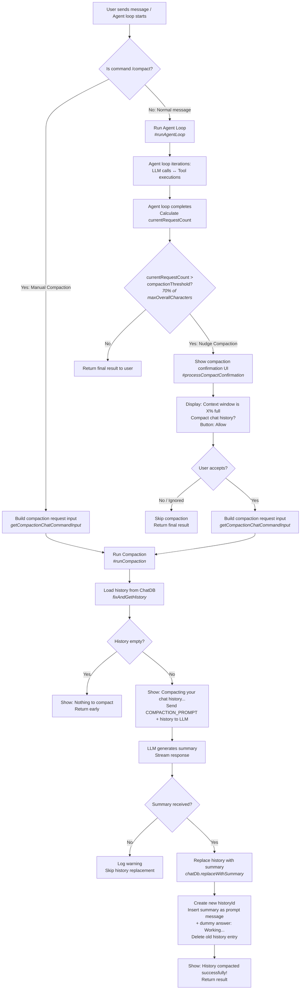
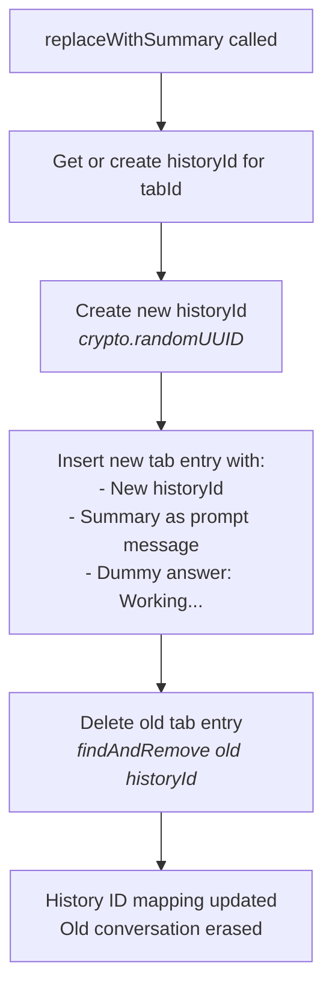
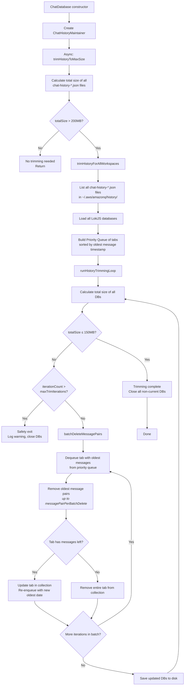
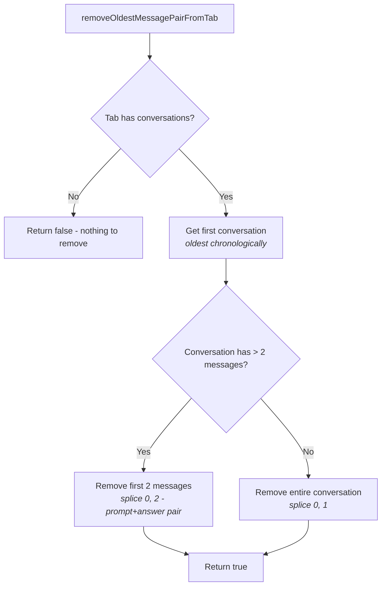
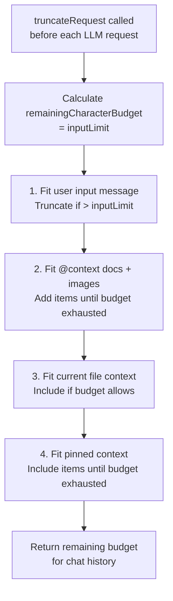
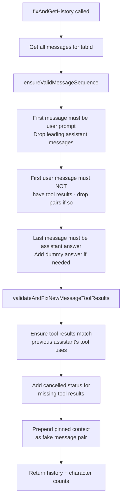
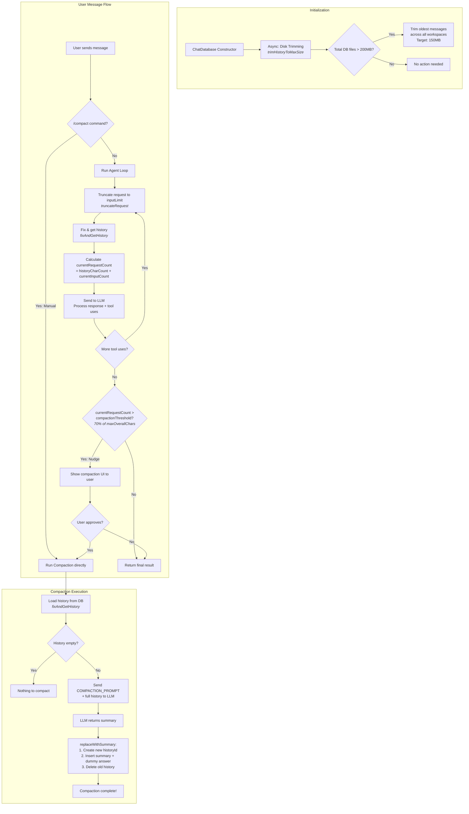

# Agentic Chat Compaction Flow

## Overview

The language-servers codebase implements **two distinct compaction mechanisms** for agentic chat:

1. **In-Session Compaction (Context Window Management)** — Summarizes conversation history when the LLM context window is nearing its limit, keeping the conversation coherent.
2. **Disk-Level History Trimming (Storage Management)** — Trims the oldest messages across all workspaces when total disk storage exceeds 200MB.

---

## Key Files

| File                           | Role                                                                                             |
| ------------------------------ | ------------------------------------------------------------------------------------------------ |
| `agenticChatController.ts`     | Orchestrates compaction triggers, agent loop, and LLM calls                                      |
| `chatDb.ts`                    | Database operations: `fixAndGetHistory`, `replaceWithSummary`, `calculateMessagesCharacterCount` |
| `chatHistoryMaintainer.ts`     | Disk-level trimming of old messages across all workspaces                                        |
| `util.ts`                      | Data types (`Tab`, `Conversation`, `Message`), priority queue, adapters                          |
| `tokenLimitsCalculator.ts`     | Calculates dynamic thresholds based on model's `maxInputTokens`                                  |
| `agenticChatTriggerContext.ts` | Builds the `COMPACTION_PROMPT` request to send to LLM                                            |
| `constants/constants.ts`       | `COMPACTION_PROMPT` (summarization system prompt), `COMPACTION_BODY`                             |

---

## Token Limits (Default: 200K input tokens)

| Parameter              | Formula                          | Default Value |
| ---------------------- | -------------------------------- | ------------- |
| `maxInputTokens`       | From API or 200,000              | 200,000       |
| `maxOverallCharacters` | `maxInputTokens × 3.5`           | 700,000       |
| `inputLimit`           | `maxOverallCharacters − 100,000` | 600,000       |
| `compactionThreshold`  | `0.7 × maxOverallCharacters`     | 490,000       |

---

## Flow 1: In-Session Compaction (Context Window Management)

### Trigger Paths

There are **two ways** compaction is triggered:

-   **Manual**: User types `/compact` command
-   **Nudge (Auto)**: After the agent loop ends, if `currentRequestCount > compactionThreshold`

### replaceWithSummary Detail

### COMPACTION_PROMPT Summary

The `COMPACTION_PROMPT` instructs the LLM to generate a summary with these sections:

1. **Conversation Summary** — Key topics discussed
2. **Files and Code Summary** — File paths, function signatures, key changes
3. **Key Insights** — User preferences, technical details, decisions
4. **Most Recent Topic** — Detailed summary of latest topic + all tools executed

---

## Flow 2: Disk-Level History Trimming (Storage Management)

This runs **asynchronously on ChatDatabase initialization** to prevent unbounded disk growth.

### Thresholds

| Parameter                   | Value               |
| --------------------------- | ------------------- |
| `maxHistorySizeInBytes`     | 200 MB              |
| `targetHistorySizeInBytes`  | 150 MB (75% of max) |
| `batchDeleteIterations`     | 200                 |
| `messagePairPerBatchDelete` | 5                   |
| `maxTrimIterations`         | 100                 |

### Message Pair Removal Detail

---

## Flow 3: Request Truncation (Pre-Send Budget Management)

Before each LLM request, the controller truncates the request to fit within the `inputLimit`.

---

## Flow 4: History Validation (fixAndGetHistory)

Before each LLM request, history is loaded and validated.

---

## Complete End-to-End Flow

---

## Summary

| Mechanism              | Trigger                                                          | What it does                                                          | Where                                                            |
| ---------------------- | ---------------------------------------------------------------- | --------------------------------------------------------------------- | ---------------------------------------------------------------- |
| **Manual Compaction**  | User types `/compact`                                            | Sends history to LLM for summarization, replaces history with summary | `agenticChatController.ts` → `#runCompaction`                    |
| **Nudge Compaction**   | `currentRequestCount > 70% maxOverallChars` at end of agent loop | Shows confirmation UI, then same as manual                            | `agenticChatController.ts` → `#shouldCompact` → `#runCompaction` |
| **Disk Trimming**      | On `ChatDatabase` init, total DB files > 200MB                   | Deletes oldest message pairs across all workspaces until < 150MB      | `chatHistoryMaintainer.ts` → `trimHistoryToMaxSize`              |
| **Request Truncation** | Before every LLM request                                         | Truncates user input, context, and pinned context to fit `inputLimit` | `agenticChatController.ts` → `truncateRequest`                   |
| **History Validation** | Before every LLM request                                         | Ensures valid message sequence, fixes tool result mismatches          | `chatDb.ts` → `fixAndGetHistory`                                 |
