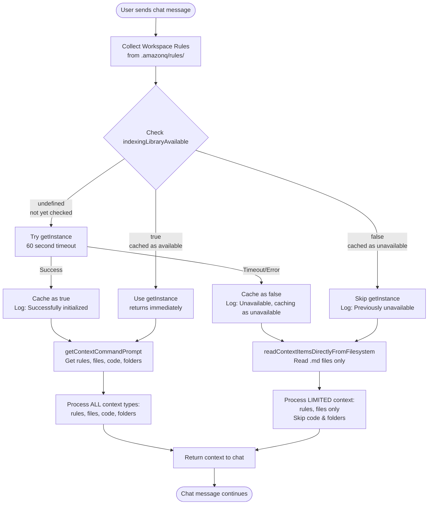
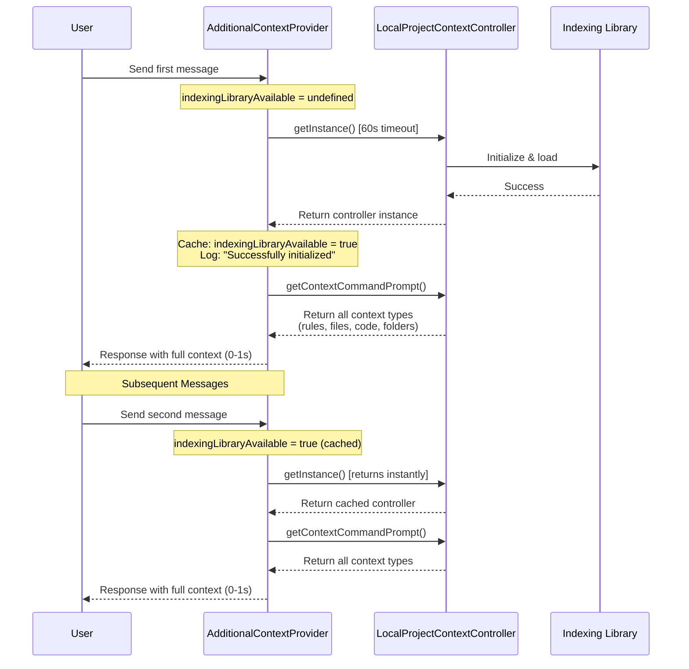
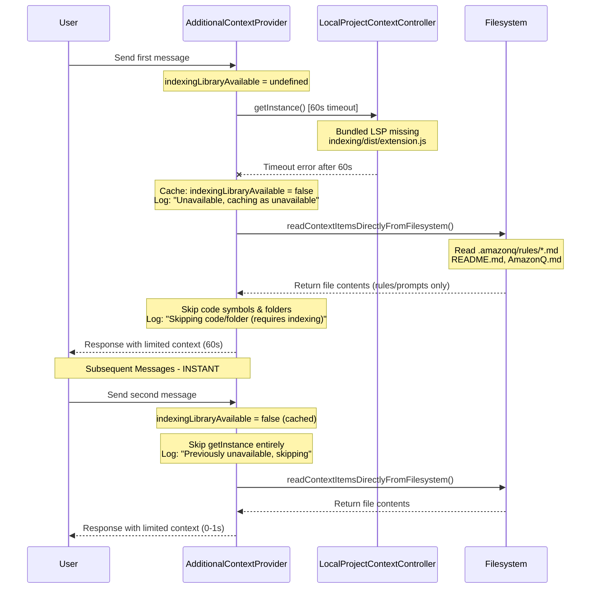
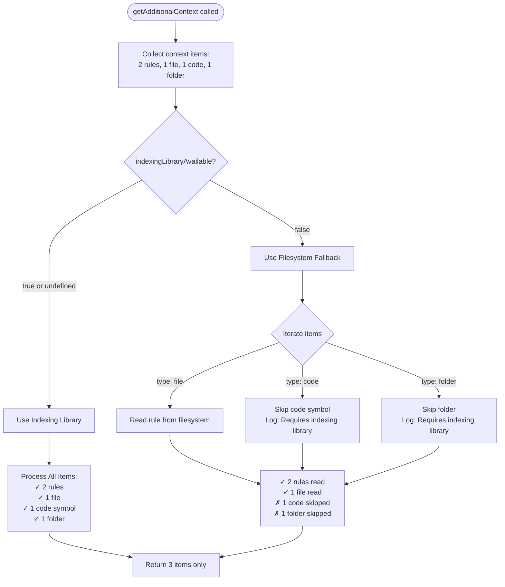

# Indexing Library Flow - Amazon Q Developer Context Provider

## Overview

This document describes how the Amazon Q Developer extension handles context retrieval using the indexing library, with a focus on the caching mechanism that prevents repeated timeouts.

## Problem Statement

**Before Fix:**

-   Equifax (Account: 082895963965) experienced ~60 second latency on EVERY chat message
-   Root cause: Bundled LSP missing indexing library binary → repeated `getInstance()` timeouts
-   Each message waited 60 seconds before falling back to filesystem read
-   Telemetry showed `cwsprChatRuleContextLength: 0` (rules not loaded)

**After Fix:**

-   FIRST message: 60 second wait (only if needed)
-   ALL subsequent messages: 0 second wait (cached failure)
-   Rules successfully loaded via direct filesystem read

## Architecture Components

### 1. Context Types

The system handles four types of context:

| Type             | Source                                           | Requires Indexing Library | Fallback Available  |
| ---------------- | ------------------------------------------------ | ------------------------- | ------------------- |
| **Rules**        | `.amazonq/rules/*.md`, `README.md`, `AmazonQ.md` | ❌ No                     | ✅ Yes (filesystem) |
| **Prompts**      | User prompts directory `*.md`                    | ❌ No                     | ✅ Yes (filesystem) |
| **Files**        | Regular project files                            | ❌ No                     | ✅ Yes (filesystem) |
| **Code Symbols** | Functions, classes, methods                      | ✅ Yes                    | ❌ No (skipped)     |
| **Folders**      | Directory-level context                          | ✅ Yes                    | ❌ No (skipped)     |

### 2. Indexing Library States

```typescript
indexingLibraryAvailable: boolean | undefined
```

| Value       | Meaning                      | Behavior                             |
| ----------- | ---------------------------- | ------------------------------------ |
| `undefined` | Not yet checked              | Try `getInstance()` with 60s timeout |
| `true`      | Available & initialized      | Use `getInstance()` (instant)        |
| `false`     | Unavailable (cached failure) | Skip to filesystem read (instant)    |

### 3. Cache Persistence & Scope

**Storage Location**: In-memory instance variable (not persisted to disk)

**Cache Lifetime**: Per VS Code session

-   ✅ **Persists**: Across multiple chat messages within the same VS Code session
-   ❌ **Cleared**: When VS Code window is reloaded (Cmd+R / Ctrl+R)
-   ❌ **Cleared**: When LSP server restarts
-   ❌ **Cleared**: When extension is reloaded

**Cache Scope**: Per `AdditionalContextProvider` instance

-   Each LSP server instance has its own `AdditionalContextProvider`
-   Typically one provider per VS Code window
-   Not shared across different VS Code windows or projects

**Example Timeline**:

```
VS Code Opens → Provider created → indexingLibraryAvailable = undefined

Message 1 sent → Try getInstance() → Timeout → Cache = false (60s)
Message 2 sent → Skip getInstance (cached) → Direct filesystem (0s)
Message 3 sent → Skip getInstance (cached) → Direct filesystem (0s)
...
Message 100 sent → Still using cached value → Direct filesystem (0s)

VS Code Reloaded → Provider destroyed and recreated → indexingLibraryAvailable = undefined

Message 1 sent → Try getInstance() again → Timeout → Cache = false (60s)
Message 2 sent → Skip getInstance (cached) → Direct filesystem (0s)
...
```

**Why In-Memory Only?**

1. **Session-specific**: Indexing library availability can change between sessions
2. **Simple implementation**: No need for file I/O or state management
3. **Self-correcting**: If environment changes (e.g., firewall rules fixed), reload clears cache
4. **Low cost**: First message pays 60s cost once per session, not repeatedly

## Flow Diagrams

### Main Flow: getAdditionalContext()



### Scenario 1: First Message - Indexing Library Available



### Scenario 2: First Message - Indexing Library Unavailable (Bundled LSP)



### Scenario 3: Mixed Context Types with Fallback



## Implementation Details

### Key Files Modified

1. **`additionalContextProvider.ts`**

    - Added `indexingLibraryAvailable` instance variable
    - Modified `getAdditionalContext()` to implement caching logic
    - Added `readContextItemsDirectlyFromFilesystem()` fallback method

2. **`localProjectContextController.ts`**

    - Added `isInitialized()` static method (used in other components)
    - Existing `getInstance()` has 60-second timeout

3. **`agenticChatController.ts`**
    - Uses `isInitialized()` before calling `getInstance()` to prevent crashes
    - Added `.catch()` handlers for unhandled promise rejections

### Code Example: Caching Logic

```typescript
// In AdditionalContextProvider class
private indexingLibraryAvailable: boolean | undefined = undefined

async getAdditionalContext(...) {
    // ... collect workspace rules ...

    if (this.indexingLibraryAvailable === false) {
        // CACHED AS UNAVAILABLE - Skip wait, read directly
        this.features.logging.debug(
            'Indexing library previously unavailable, skipping getInstance()'
        )
        promptContextPrompts = await this.readContextItemsDirectlyFromFilesystem(...)
        pinnedContextPrompts = await this.readContextItemsDirectlyFromFilesystem(...)
    } else {
        // FIRST ATTEMPT or CACHED AS AVAILABLE
        try {
            const controller = await LocalProjectContextController.getInstance()
            promptContextPrompts = await controller.getContextCommandPrompt(...)
            pinnedContextPrompts = await controller.getContextCommandPrompt(...)

            // Cache success
            if (this.indexingLibraryAvailable === undefined) {
                this.indexingLibraryAvailable = true
                this.features.logging.info('Successfully initialized and cached')
            }
        } catch (error) {
            // Cache failure, then fallback
            this.indexingLibraryAvailable = false
            this.features.logging.warn('Unavailable, caching as unavailable')
            promptContextPrompts = await this.readContextItemsDirectlyFromFilesystem(...)
            pinnedContextPrompts = await this.readContextItemsDirectlyFromFilesystem(...)
        }
    }

    // ... process and return context ...
}
```

## Performance Comparison

### Before Fix (Every Message Waits)

```
Message 1: 60s wait → fallback → response
Message 2: 60s wait → fallback → response
Message 3: 60s wait → fallback → response
Message 4: 60s wait → fallback → response
...
Total for 10 messages: ~600 seconds
```

### After Fix (Only First Message Waits)

```
Message 1: 60s wait → cache failure → fallback → response
Message 2: 0s wait (cached) → fallback → response
Message 3: 0s wait (cached) → fallback → response
Message 4: 0s wait (cached) → fallback → response
...
Total for 10 messages: ~60 seconds
```

**Performance Improvement: 90% reduction in total latency**

## Edge Cases Handled

1. **Re-initialization After Environment Change**:

    - If indexing library becomes available later (e.g., firewall rules fixed, LSP downloaded)
    - Cache persists for the current VS Code session
    - User must **reload VS Code window** (Cmd+R / Ctrl+R) to re-check availability
    - This is by design - prevents repeated timeout attempts during a session

2. **Multiple VS Code Windows**:

    - Each VS Code window has its own LSP server instance
    - Each LSP server has its own `AdditionalContextProvider` with separate cache
    - Opening Project A and Project B in different windows = independent caches
    - Opening same project in 2 windows = still independent caches

3. **Extension Reload/Update**:

    - Extension reload/update destroys and recreates the provider
    - Cache is cleared, will re-check on next message
    - Same behavior as VS Code reload

4. **Mixed Workspace Folders**:

    - Single provider instance serves all workspace folders in a window
    - Cache applies globally across all folders
    - If ANY folder is missing indexing library → cached as unavailable for ALL folders

5. **Partial Context**:

    - When using fallback, users get rules/prompts but lose code symbols and folder context
    - This is acceptable since the primary issue was rules not loading at all (showed length: 0)
    - Users can still use @-mentions for files, just not code symbols

6. **Concurrent Chat Messages**:
    - Cache is instance-level, shared across concurrent requests
    - Thread-safe: JavaScript single-threaded, async/await ensures proper sequencing
    - First message to complete sets the cache, subsequent messages use it

## Telemetry Impact

### Before Fix

```typescript
{
    cwsprChatRuleContextLength: 0,  // Rules not loaded
    cwsprChatLatency: ~60000ms       // 60 second wait
}
```

### After Fix - First Message

```typescript
{
    cwsprChatRuleContextLength: X,   // Rules loaded from filesystem
    cwsprChatLatency: ~60000ms       // 60 second wait (one-time)
}
```

### After Fix - Subsequent Messages

```typescript
{
    cwsprChatRuleContextLength: X,   // Rules loaded from filesystem
    cwsprChatLatency: <1000ms        // Instant response
}
```

## Testing Strategy

Comprehensive test cases added to verify:

-   ✅ First timeout caches as unavailable, subsequent calls skip wait
-   ✅ First success caches as available, subsequent calls use getInstance
-   ✅ Mixed context types handled correctly with fallback
-   ✅ Proper logging at each stage (info, warn, debug)
-   ✅ File read errors handled gracefully

## Rollout Plan

1. **Testing**: Run unit tests to verify caching behavior
2. **Internal Testing**: Test with bundled LSP (simulating Equifax environment)
3. **Staged Rollout**: Deploy to beta/canary channels first
4. **Monitor Telemetry**: Watch for `cwsprChatRuleContextLength` and latency metrics
5. **Full Rollout**: Deploy to all users once validated

## Future Improvements

1. **Periodic Re-check**: Add mechanism to periodically re-check indexing library availability (e.g., every 5 minutes)
2. **User Notification**: Show banner when code symbols/folders are unavailable due to missing indexing library
3. **Async Initialization**: Start indexing library initialization in background on extension startup
4. **Workspace-Specific Cache**: Cache per workspace folder instead of globally
