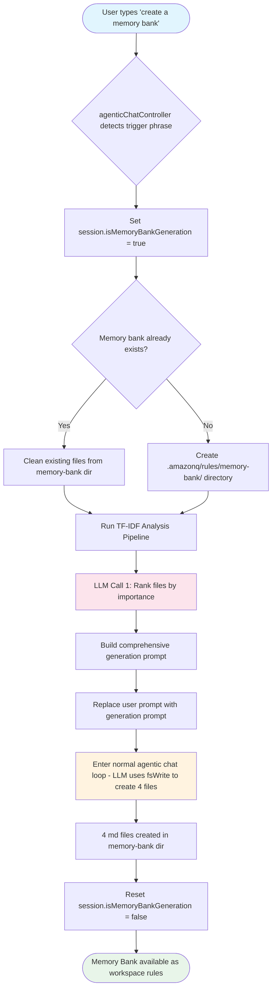
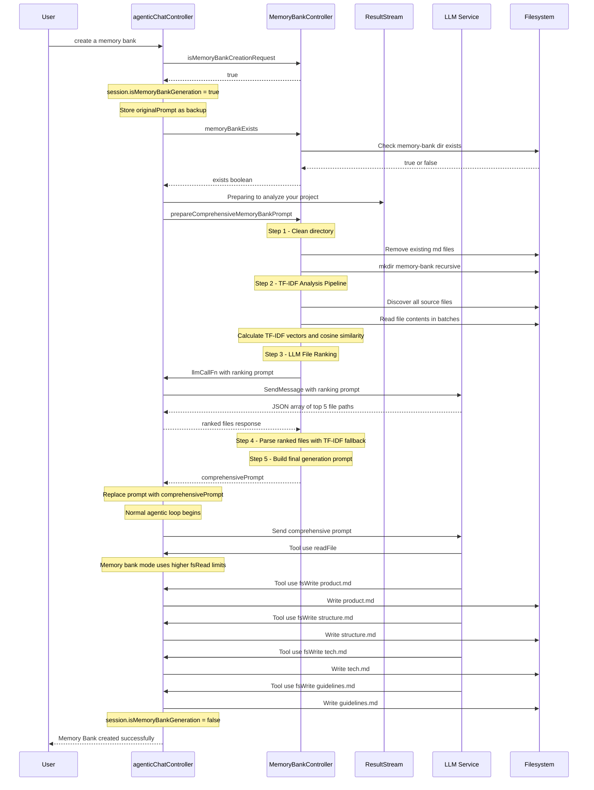
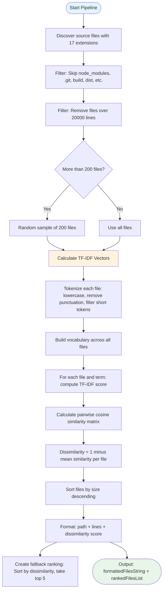
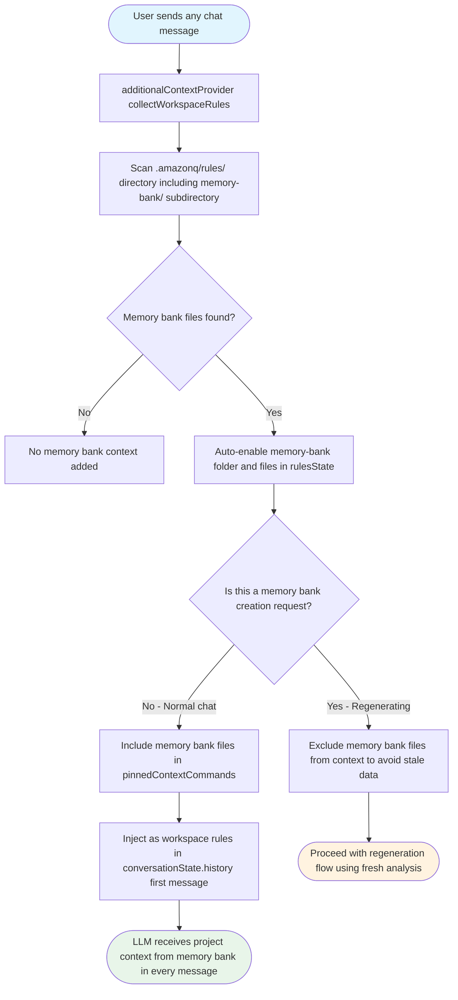
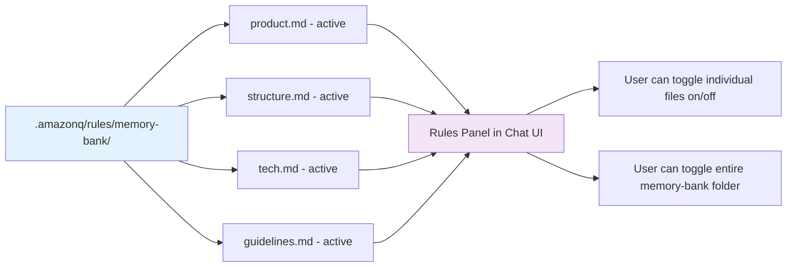
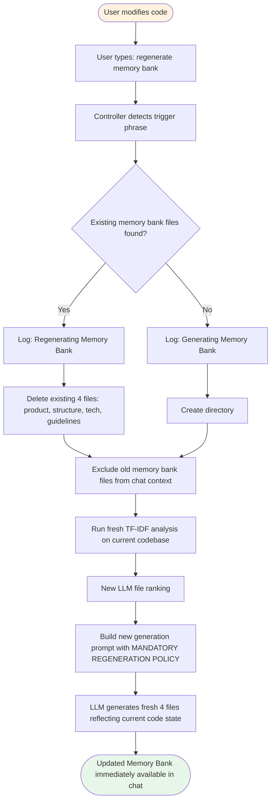
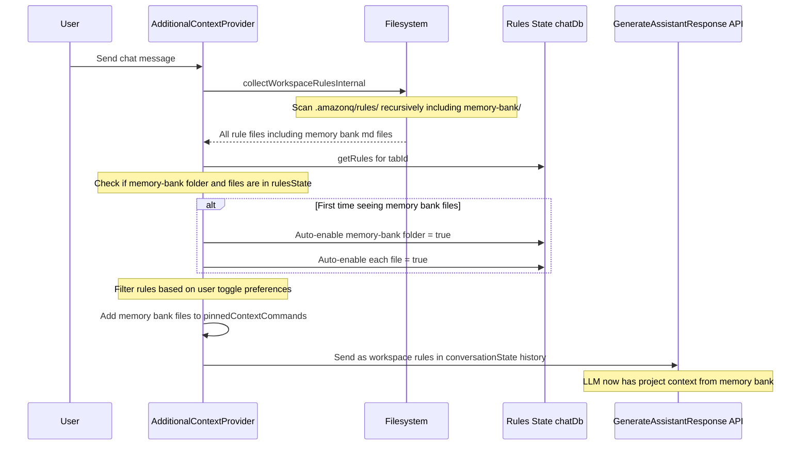
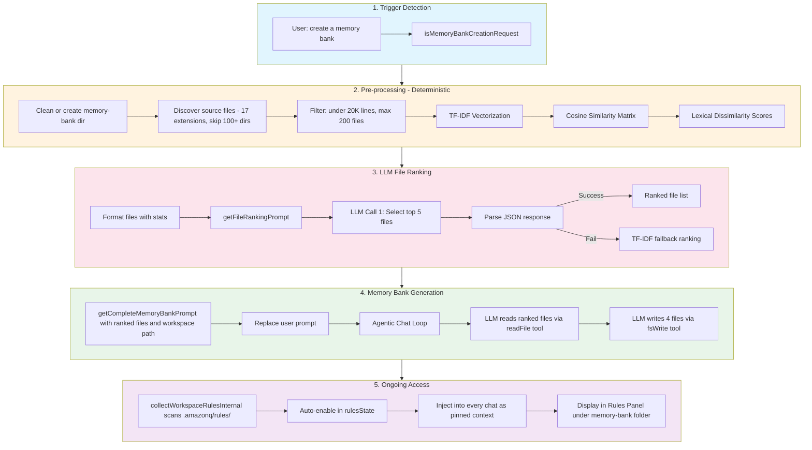

# Memory Bank Implementation - Amazon Q Developer Language Servers

## Overview

Memory Bank is a feature in Amazon Q Developer that automatically generates and maintains a set of project documentation files by analyzing the user's codebase. These generated documents are stored as **rules** inside the workspace and are automatically included in every chat conversation, giving the LLM persistent, structured context about the project's purpose, structure, technologies, and coding guidelines.

The feature lives entirely in the **language-servers** repository, specifically within the agentic chat subsystem of `aws-lsp-codewhisperer`.

---

## Key Concepts

| Concept                 | Description                                                       |
| ----------------------- | ----------------------------------------------------------------- |
| **Memory Bank**         | A set of 4 auto-generated `.md` files that describe a project     |
| **Storage Location**    | `.amazonq/rules/memory-bank/` inside the user's workspace         |
| **Generated Files**     | `product.md`, `structure.md`, `tech.md`, `guidelines.md`          |
| **Access Pattern**      | Loaded as **workspace rules** and injected into every chat prompt |
| **Trigger**             | User types a natural language phrase like "create a memory bank"  |
| **Re-trigger / Update** | User types "regenerate memory bank" (same trigger phrases)        |

---

## Architecture Components

### Source Files

All Memory Bank code resides in the language-servers repository:

```
language-servers/
└── server/aws-lsp-codewhisperer/src/language-server/agenticChat/
    ├── agenticChatController.ts          # Orchestrates the memory bank creation flow
    ├── constants/
    │   └── constants.ts                  # Memory bank constants (file limits, ranking count)
    └── context/
        ├── additionalContextProvider.ts  # Injects memory bank files into chat prompts
        └── memorybank/
            ├── memoryBankController.ts   # Core logic: detection, analysis, prompt building
            ├── memoryBankPrompts.ts      # LLM prompt templates for file ranking & generation
            └── memoryBankController.test.ts  # Unit tests
```

### Constants

Defined in `constants/constants.ts`:

| Constant                                      | Value         | Purpose                                                      |
| --------------------------------------------- | ------------- | ------------------------------------------------------------ |
| `FSREAD_MEMORY_BANK_MAX_PER_FILE`             | 20,000 chars  | Max characters per file read during memory bank generation   |
| `FSREAD_MEMORY_BANK_MAX_TOTAL`                | 100,000 chars | Max total characters read across all files during generation |
| `MAX_NUMBER_OF_FILES_FOR_MEMORY_BANK_RANKING` | 5             | Number of top files selected for deep analysis               |

### The 4 Generated Documents

Stored at `.amazonq/rules/memory-bank/` relative to the workspace root:

| File            | Purpose              | Content                                                                  |
| --------------- | -------------------- | ------------------------------------------------------------------------ |
| `product.md`    | Project overview     | Purpose, value proposition, key features, target users                   |
| `structure.md`  | Project organization | Directory structure, core components, architectural patterns             |
| `tech.md`       | Technology details   | Languages, versions, build systems, dependencies, dev commands           |
| `guidelines.md` | Development patterns | Code quality standards, naming conventions, design patterns, code idioms |

---

## Flow Diagrams

### High-Level: End-to-End Memory Bank Lifecycle



### Detailed: Memory Bank Creation Flow in agenticChatController



### Detailed: TF-IDF Analysis Pipeline



### How Memory Bank Files Are Accessed in Chat Prompts



### Rules Panel: Memory Bank File Display



---

## Prompt Architecture

Memory Bank uses **two LLM prompts**, defined in `memoryBankPrompts.ts`:

### Prompt 1: File Ranking (`getFileRankingPrompt`)

**Purpose:** Ask the LLM to select the top N most important/representative files from the TF-IDF analysis results.

**Input:** A formatted string of all discovered files with their line counts and lexical dissimilarity scores.

**Output:** A JSON array of file paths (e.g., `["src/main.ts", "src/core/engine.ts", ...]`)

**Fallback:** If LLM ranking fails to parse, the system falls back to the deterministic TF-IDF dissimilarity ranking.

```
Location: memoryBankPrompts.ts → getFileRankingPrompt()
Called from: memoryBankController.ts → prepareComprehensiveMemoryBankPrompt()
```

### Prompt 2: Complete Memory Bank Generation (`getCompleteMemoryBankPrompt`)

**Purpose:** Instruct the LLM to explore the codebase and create the 4 memory bank files using `fsWrite` tool.

**Input:** The ranked file list and the normalized workspace root path.

**Key Instructions in the Prompt:**

-   Always regenerate fresh (never skip if files exist)
-   Fresh exploration policy: ignore previous chat history
-   Create files in order: `product.md` → `structure.md` → `tech.md` → `guidelines.md`
-   Use `fsWrite` tool with `command: "create"` for file creation
-   For `guidelines.md`: iteratively read ranked files in chunks of 2, analyze patterns
-   Keep completion summary brief (max 8 lines)

```
Location: memoryBankPrompts.ts → getCompleteMemoryBankPrompt()
Called from: memoryBankController.ts → prepareComprehensiveMemoryBankPrompt()
Injected into: agenticChatController.ts → replaces params.prompt.prompt
```

---

## Trigger Detection

The `MemoryBankController.isMemoryBankCreationRequest()` method checks the user's prompt against a list of trigger phrases:

| Trigger Phrase           | Creates New | Updates Existing |
| ------------------------ | :---------: | :--------------: |
| `create a memory bank`   |     ✅      |        ✅        |
| `create memory bank`     |     ✅      |        ✅        |
| `generate a memory bank` |     ✅      |        ✅        |
| `generate memory bank`   |     ✅      |        ✅        |
| `regenerate memory bank` |     ✅      |        ✅        |
| `build memory bank`      |     ✅      |        ✅        |
| `make memory bank`       |     ✅      |        ✅        |
| `setup memory bank`      |     ✅      |        ✅        |

The detection is case-insensitive and uses `.includes()` matching, so phrases like "Please create a memory bank for my project" will also trigger it.

---

## How to Re-trigger / Update Memory Bank

When a user makes code changes and wants to update their memory bank documentation:



**Key behavior during regeneration:**

1. Old memory bank files are **deleted** before generation starts
2. Old memory bank files are **excluded from chat context** (via `additionalContextProvider.ts`) so the LLM doesn't see stale documentation
3. The generation prompt explicitly instructs the LLM to **NEVER reference existing files** and to **always create fresh**
4. After regeneration, the new files are automatically detected as workspace rules and included in subsequent chats

---

## Session Flag: `isMemoryBankGeneration`

A boolean flag on the chat session object that tracks whether the current conversation turn is a memory bank generation:

| When Set                 | Value   | Effect                                                |
| ------------------------ | ------- | ----------------------------------------------------- |
| Trigger phrase detected  | `true`  | Marks session as memory bank generation               |
| `fsRead` tool invoked    | checked | Uses higher file size limits (20KB/file, 100KB total) |
| Generation completes     | `false` | Returns to normal chat behavior                       |
| Preparation fails        | `false` | Restores original prompt, proceeds normally           |
| Session ends / chat ends | `false` | Cleanup on session termination                        |

This flag ensures that during memory bank generation, the LLM can read larger files than normal to perform thorough codebase analysis.

---

## How Generated Documents Are Accessed in Prompts

Once the 4 memory bank files exist on disk, they are automatically included in every subsequent chat:



### Access Path Summary

1. **Storage:** `.amazonq/rules/memory-bank/{product,structure,tech,guidelines}.md`
2. **Discovery:** `additionalContextProvider.ts` → `collectWorkspaceRulesInternal()` scans `.amazonq/rules/` recursively
3. **Auto-activation:** Memory bank files are automatically enabled when first discovered (unlike other rules which may default based on folder state)
4. **Special folder name:** Memory bank files appear under the `memory-bank` folder in the Rules Panel UI
5. **Injection:** Added to `pinnedContextCommands` → sent as the first message in `conversationState.history` in the GenerateAssistantResponse API call
6. **Toggle control:** Users can toggle individual memory bank files or the entire `memory-bank` folder on/off in the Rules Panel

---

## Error Handling & Fallbacks

| Scenario                          | Behavior                                                          |
| --------------------------------- | ----------------------------------------------------------------- |
| No workspace folder found         | Error thrown, original prompt restored                            |
| No source files discovered        | Pipeline throws error, original prompt restored                   |
| TF-IDF calculation fails          | Returns fallback dissimilarity value of 0.85 for all files        |
| LLM file ranking fails to parse   | Falls back to deterministic TF-IDF dissimilarity ranking          |
| LLM ranking returns empty         | Falls back to TF-IDF ranking                                      |
| Comprehensive prompt is empty     | Original user prompt is used instead                              |
| Overall preparation fails         | Original prompt restored, `isMemoryBankGeneration` reset to false |
| File read errors during TF-IDF    | Empty content used, continues with other files                    |
| Files over 20,000 lines           | Filtered out to prevent conversation overflow                     |
| Projects with more than 200 files | Random sample of 200 taken for analysis                           |

---

## Complete Data Flow Summary



---

## Testing

Tests are located in `memoryBankController.test.ts` and cover:

-   Trigger phrase detection (positive and negative cases)
-   Memory bank existence checking
-   Directory cleaning and creation
-   TF-IDF analysis pipeline
-   File ranking prompt generation
-   Error handling and fallback scenarios
